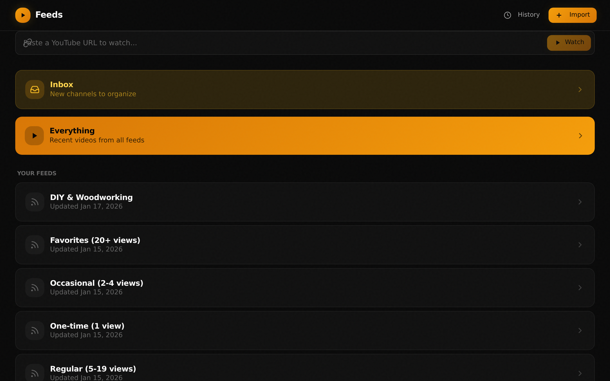
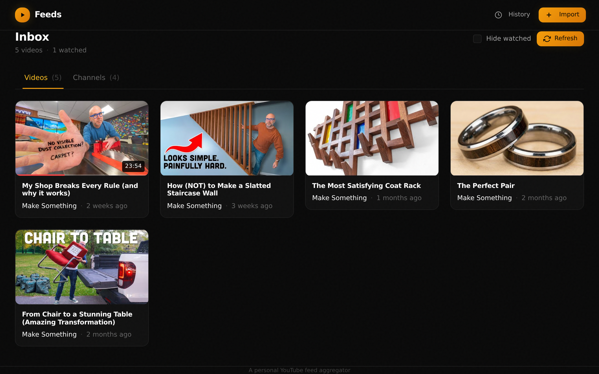
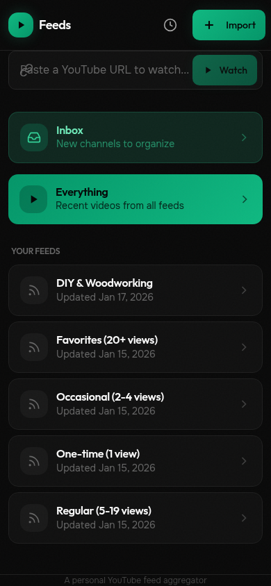
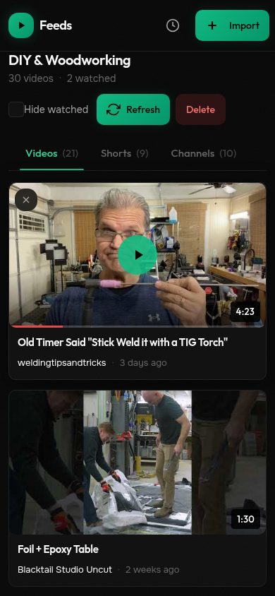

# Feeds

**Non-algorithmic video subscriptions, self-hosted.**

Feeds is a self-hosted YouTube subscription manager that puts you back in control. No algorithms deciding what you see—just chronological updates from creators you choose, organized into feeds you curate.

<p align="center">
  
</p>

<p align="center">
  
</p>

<details>
<summary>📱 Mobile Screenshots</summary>
<p align="center">
  
  
</p>
</details>

## Architecture

- **Backend**: Go HTTP server with SQLite
- **Frontend**: SvelteKit SPA (Vite dev server)
- **Production**: `make build` builds the SPA and embeds `web/dist` into the Go binary
- **Development**: Go server on `:8080`, Vite dev server on `:5173` (API proxied to Go)

## Why Feeds?

YouTube's algorithm optimizes for engagement, not your interests. Feeds takes a different approach:

- **Chronological, always** — See what your subscriptions posted, in order, nothing more
- **Curated feeds** — Group channels by mood, topic, or whatever makes sense to you
- **Shareable lists** — Export a feed as JSON and share it; others can import without polluting their main subscriptions
- **Self-hosted persistence** — Your watch history, progress, and feeds live on your server, synced across all your devices
- **yt-dlp powered** — Stream or download videos however you want

## The workflow

The best way to use Feeds:

1. **Import your YouTube watch history** — Export from [Google Takeout](https://takeout.google.com) (make sure to select JSON format). This gives you a realistic picture of what you actually watch, not just what you subscribed to years ago.

2. **Let Feeds organize by frequency** — Your channels get sorted into tiers based on how often you've watched them. Heavy Rotation (50+ videos), Regulars (20-49), Frequent (10-19), and so on down to one-time watches.

3. **These become your "firehose" feeds** — Browse through them at your own pace. They're sorted by watch count, so your most-watched creators are easy to find.

4. **Curate your Inbox** — As you browse, add creators you want to keep up with to your Inbox. This becomes your main subscription feed—the channels you actually care about seeing new content from.

5. **Optionally, create topic feeds** — Maybe you want a "News" feed you check daily, a "Cooking" feed for weekends, or a "Background noise" feed for working. Move channels around as it makes sense.

The key insight: your watch history is a better signal than your subscriptions. Most people have hundreds of subscribed channels they never watch. Starting from history means you're building from actual behavior.

## How it compares

| | Feeds | YouTube | Piped | Grayjay |
|---|-------|---------|-------|---------|
| Algorithm-free | Yes | No | Yes | Yes |
| Self-hosted | Yes | No | Yes | No |
| Persistent history | Yes | Yes | No | Device-only |
| Multi-device sync | Yes | Yes | No | No |
| Shareable feed lists | Yes | No | No | No |
| Download support | Yes | No | Some | Yes |

Piped is great for privacy-first proxying for many users. Grayjay is great as a mobile app. Feeds is for when you want a single server that holds your subscriptions, history, and curated lists—your own YouTube replacement that you control completely.

## Features

- **Feed management** — Create feeds like "Tech", "Music", "Politics", "Cooking"
- **Channel organization** — Add channels to feeds, move them around, AI-assisted bulk organization
- **Import subscriptions** — Import from NewPipe exports or add channels directly
- **Watch history** — Track what you've watched with progress saved across devices
- **Everything view** — See all recent videos across all feeds in one place
- **Streaming & downloads** — Uses yt-dlp under the hood for reliable playback

## Installation

### Quick install (Linux/macOS)

```bash
curl -fsSL https://raw.githubusercontent.com/erik/feeds/main/install.sh | sh
```

This downloads the latest release binary to `/usr/local/bin`. Requires `curl` and optionally `sudo`.

### Prerequisites

**Required:**
- [yt-dlp](https://github.com/yt-dlp/yt-dlp) for video streaming and downloads

```bash
# macOS
brew install yt-dlp

# Linux (pip)
pip install yt-dlp

# Linux (package manager)
sudo apt install yt-dlp   # Debian/Ubuntu
sudo dnf install yt-dlp   # Fedora
```

### Running Feeds

```bash
# Start the server (creates feeds.db in current directory)
feeds

# Or specify a different port/database
FEEDS_ADDR=:3000 FEEDS_DB=/path/to/feeds.db feeds
```

Open `http://localhost:8080` in your browser.

### Running as a service (systemd)

For production deployments, run Feeds as a systemd service:

```bash
# Create a dedicated user
sudo useradd -r -s /bin/false feeds

# Create install directory
sudo mkdir -p /opt/feeds/data
sudo chown feeds:feeds /opt/feeds/data

# Download the binary
sudo curl -fsSL https://github.com/erik/feeds/releases/latest/download/feeds-linux-amd64 -o /opt/feeds/feeds
sudo chmod +x /opt/feeds/feeds

# Copy and customize the service file
sudo curl -fsSL https://raw.githubusercontent.com/erik/feeds/main/feeds.service.example -o /etc/systemd/system/feeds.service

# Enable and start
sudo systemctl daemon-reload
sudo systemctl enable feeds
sudo systemctl start feeds

# Check logs
journalctl -u feeds -f
```

### Configuration

Create a `.env` file in the working directory or set environment variables:

```bash
# Server address (default: :8080)
FEEDS_ADDR=:8080

# Database path (default: ./feeds.db)
FEEDS_DB=/path/to/feeds.db

# Path to yt-dlp cookies file (optional, for age-restricted videos)
FEEDS_YTDLP_COOKIES=/path/to/cookies.txt

# OpenAI API key (optional, enables AI-powered feed organization)
OPENAI_API_KEY=sk-...
```

### Build from source

Requires Go 1.22+ and [Bun](https://bun.sh/):

```bash
git clone https://github.com/erik/feeds.git
cd feeds
make build
./feeds
```

### Development

```bash
make dev
```

This runs the Go backend with hot-reload (via air) and the Vite dev server. Open `http://localhost:5173` in your browser.

## Sharing feeds

Export any feed as JSON from the UI. Share the file however you want—email, paste in a forum, host it somewhere. Recipients import it as a new feed without affecting their existing subscriptions.

This makes it easy to share curated lists: "Here's my favorite woodworking channels" or "Political commentators I follow across the spectrum."

## License

MIT
