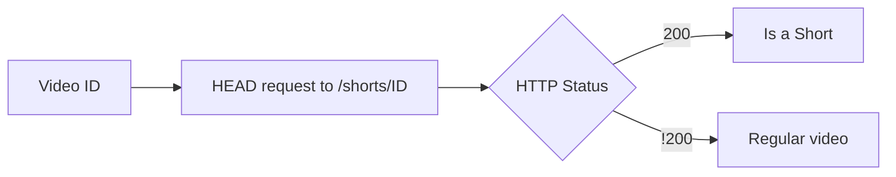
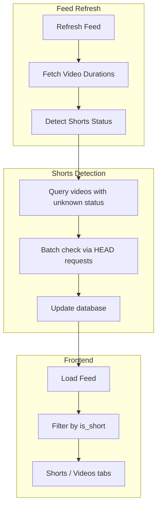
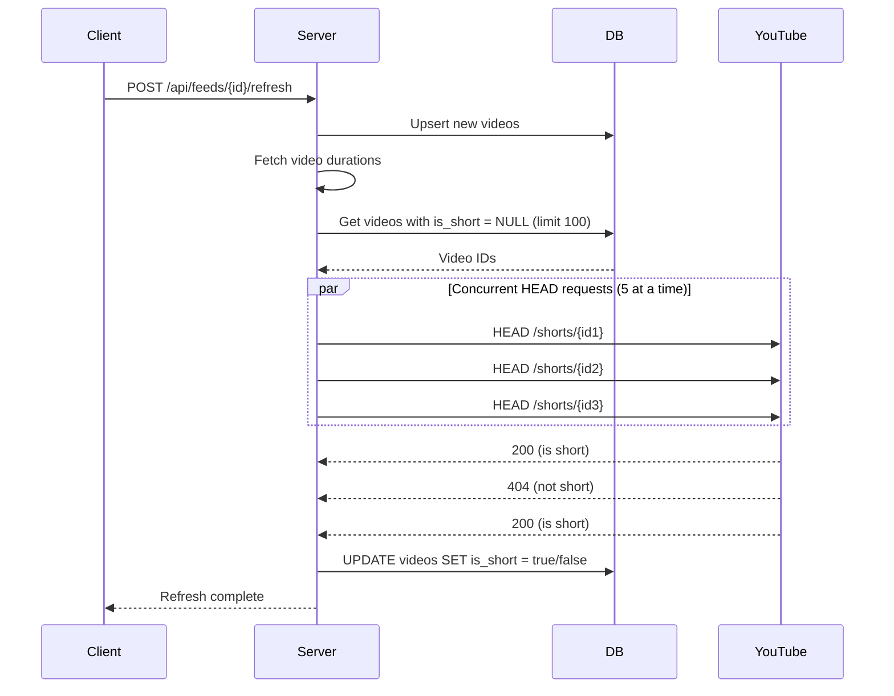
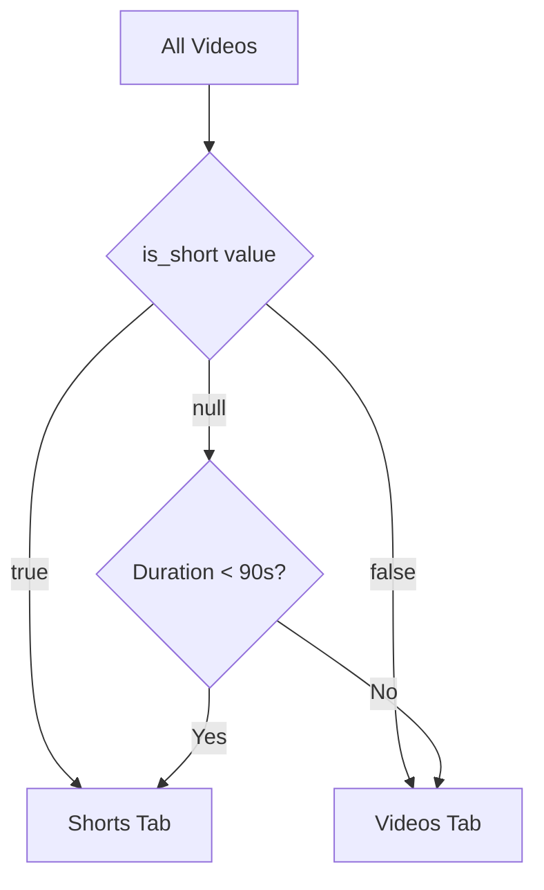

# Shorts Detection

This document explains how Feeds detects and filters YouTube Shorts from regular videos.

## Overview

YouTube Shorts are vertical videos under 60 seconds. Feeds automatically detects Shorts and allows users to view them separately from regular content.

### Why Detection is Needed

- YouTube's RSS feeds don't indicate whether a video is a Short
- Duration alone isn't reliable (some regular videos are under 60 seconds)
- Users often want to browse Shorts and regular videos separately

## Detection Method

Feeds uses YouTube's Shorts URL format to detect Shorts:

```
https://www.youtube.com/shorts/{videoId}
```

If this URL returns a 200 status, the video is a Short. Otherwise, it's a regular video.



### Why HEAD Requests?

- **Fast** - No body content downloaded
- **Reliable** - YouTube's canonical Shorts URL only works for actual Shorts
- **Simple** - No parsing or API keys required

## Architecture



## Detection Flow

### Background Processing

Shorts detection runs automatically after each feed refresh:



### Concurrency Control

- **Semaphore** - Maximum 5 concurrent HEAD requests
- **Batch size** - Up to 100 videos per refresh
- **Incremental** - Only checks videos with unknown status

## Database Schema

The `videos` table includes an `is_short` column:

```sql
ALTER TABLE videos ADD COLUMN is_short INTEGER;
```

### Tri-State Logic

| Value | Meaning |
|-------|---------|
| `NULL` | Unknown (not yet checked) |
| `1` | Confirmed Short |
| `0` | Confirmed regular video |

This allows distinguishing between "not checked" and "checked and not a Short".

## Frontend Filtering

The frontend uses `is_short` to separate videos into tabs:



### Fallback Logic

For videos that haven't been checked yet (`is_short = null`):

- **Duration < 90 seconds** → Show in Shorts tab
- **Duration >= 90 seconds or unknown** → Show in Videos tab

This provides a reasonable default while detection catches up.

### Frontend Code Pattern

```typescript
// Shorts: confirmed OR probably a short based on duration
shortsVideos = videos.filter(v =>
  v.is_short === true ||
  (v.is_short === null && v.duration > 0 && v.duration < 90)
);

// Regular: confirmed OR probably regular based on duration
regularVideos = videos.filter(v =>
  v.is_short === false ||
  (v.is_short === null && (v.duration === 0 || v.duration >= 90))
);
```

## API Integration

Shorts detection is integrated into the feed refresh flow:

| Endpoint | When Detection Runs |
|----------|---------------------|
| `POST /api/feeds/{id}/refresh` | After fetching durations |
| `GET /api/feeds/{id}/refresh` (SSE) | After fetching durations |

No separate API endpoint is needed - detection happens automatically.

## Key Functions

### Backend (`internal/youtube/rss.go`)

```go
// Check multiple videos for Shorts status
func CheckShortsStatus(videoIDs []string) map[string]bool

// Returns map of videoID -> isShort
```

### Database (`internal/db/db.go`)

```go
// Get videos that need checking
func GetVideosWithoutShortStatus(feedID int64, limit int) ([]Video, error)

// Update a video's Shorts status
func UpdateVideoIsShort(videoID string, isShort bool) error
```

### Handler (`internal/api/handlers.go`)

```go
// Called after duration fetching during refresh
func fetchMissingShortsStatus(feedID int64)
```

## Performance Considerations

### Why Batch Processing?

- **Rate limiting** - Avoids overwhelming YouTube with requests
- **Background operation** - Doesn't block feed refresh response
- **Incremental** - Only processes unknown videos

### Detection Speed

| Videos | Approximate Time |
|--------|------------------|
| 10 | ~1 second |
| 50 | ~5 seconds |
| 100 | ~10 seconds |

With 5 concurrent requests, each taking ~100-200ms.

## Edge Cases

### New Channels

When subscribing to a new channel:

1. First refresh loads all videos with `is_short = null`
2. Detection processes up to 100 videos
3. Subsequent refreshes catch remaining videos

### Detection Failures

If a HEAD request fails (network error, timeout):

- Video remains with `is_short = null`
- Will be retried on next refresh
- Frontend falls back to duration heuristic

### YouTube Changes

If YouTube changes their Shorts URL format:

- Detection would start returning false for all videos
- Fix: Update the URL pattern in `CheckShortsStatus()`

## Key Files

| File | Purpose |
|------|---------|
| `internal/youtube/rss.go` | `CheckShortsStatus()` implementation |
| `internal/db/db.go` | Database queries for Shorts status |
| `internal/api/handlers.go` | Integration with feed refresh |
| `web/frontend/src/routes/feeds/[id]/+page.svelte` | Frontend filtering UI |
