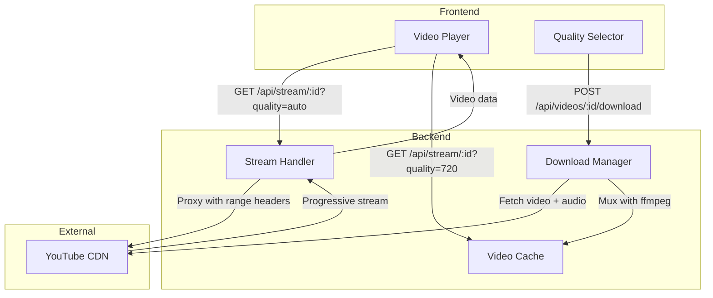
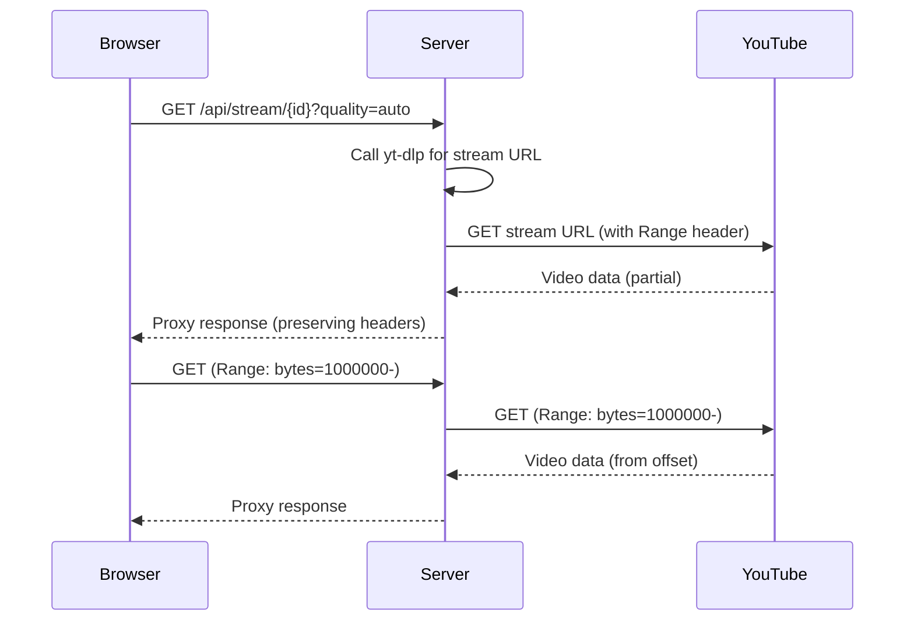
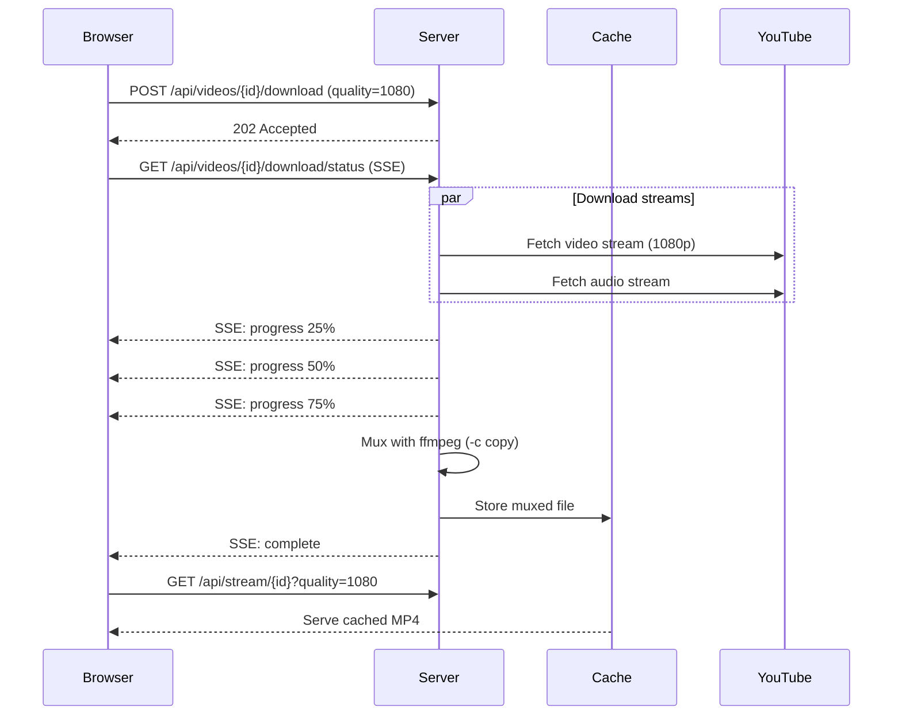
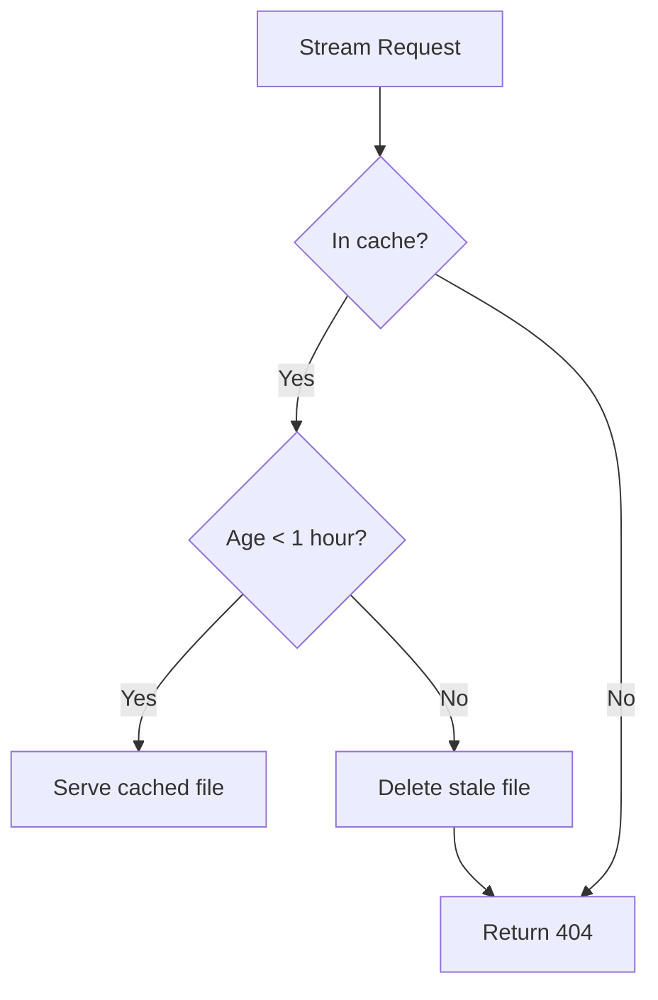

# Video Streaming

This document explains how video streaming works in Feeds, covering progressive playback and HD downloads.

## Overview

Feeds uses a **download-first streaming model** with two distinct playback modes:

1. **Progressive streaming** - Instant playback at auto quality (up to 720p), proxied directly from YouTube
2. **HD downloads** - Background muxing of separate video/audio streams for higher quality playback

This approach balances immediate playback with access to higher quality options.

## Architecture



## Progressive Streaming

Progressive streaming provides instant playback by proxying YouTube's combined (muxed) streams.

### How It Works



### Key Points

- **No local storage required** - Video streams directly from YouTube through the server
- **Range request support** - Full seeking capability via proxied range headers
- **Quality limitation** - YouTube's progressive streams max out around 720p
- **Immediate playback** - No waiting for downloads or processing

### Implementation

The stream handler (`internal/api/handlers.go`) routes requests based on quality:

- `quality=auto` → Proxy progressive stream from YouTube
- `quality=720/1080/etc` → Serve from cache (or 404 if not downloaded)

## HD Downloads

For quality above 720p, YouTube serves video and audio as separate streams. The server downloads and muxes these in the background.

### How It Works



### Download Manager

The Download Manager (`internal/api/download.go`) handles:

- **Concurrent downloads** - Up to 5 simultaneous downloads
- **Progress tracking** - Real-time progress via Server-Sent Events (SSE)
- **Parallel fetching** - Video and audio streams download simultaneously
- **Muxing** - Combines streams using ffmpeg with `-c copy` (no re-encoding)

### Muxing Process

```bash
ffmpeg -i video.mp4 -i audio.m4a -c copy -movflags +faststart output.mp4
```

- `-c copy` - Stream copy (no transcoding), very fast
- `+faststart` - Moves metadata to file start for immediate playback

## Video Cache

Downloaded videos are cached locally for reuse.

### Cache Configuration

| Setting | Value |
|---------|-------|
| Location | `/tmp/feeds-video-cache/` |
| File format | `{videoId}_{quality}.mp4` |
| TTL | 1 hour |
| Cleanup interval | Every 10 minutes |

### Cache Flow



The cache manager (`internal/api/cache.go`) runs a background goroutine that:

1. Scans the cache directory every 10 minutes
2. Deletes files older than 1 hour
3. Logs cleanup activity

## Quality Selection

### Available Qualities

The `/api/videos/{id}/qualities` endpoint returns available quality options by querying YouTube via yt-dlp.

### Frontend Flow

1. User clicks quality button (720p, 1080p, etc.)
2. Frontend checks if quality is cached via stream endpoint
3. If not cached, initiates download and shows progress overlay
4. On completion, switches video source to cached file

### Fallback Behavior

If a specific quality isn't available:

- Frontend falls back to auto quality
- User sees available options only
- Progressive stream ensures something always plays

## API Endpoints

| Endpoint | Method | Purpose |
|----------|--------|---------|
| `/api/stream/{id}` | GET | Stream video (quality param) |
| `/api/videos/{id}/download` | POST | Start HD download |
| `/api/videos/{id}/download/status` | GET | SSE progress stream |
| `/api/videos/{id}/qualities` | GET | List available qualities |

## Key Files

| File | Purpose |
|------|---------|
| `internal/api/handlers.go` | Stream routing and proxy logic |
| `internal/api/download.go` | Download manager and muxing |
| `internal/api/cache.go` | Video cache with TTL |
| `web/frontend/src/routes/watch/[id]/+page.svelte` | Video player UI |
